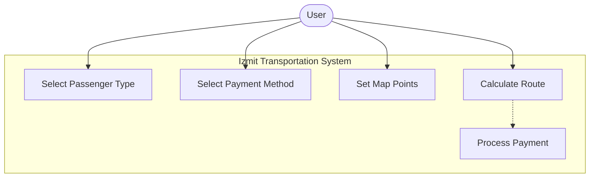
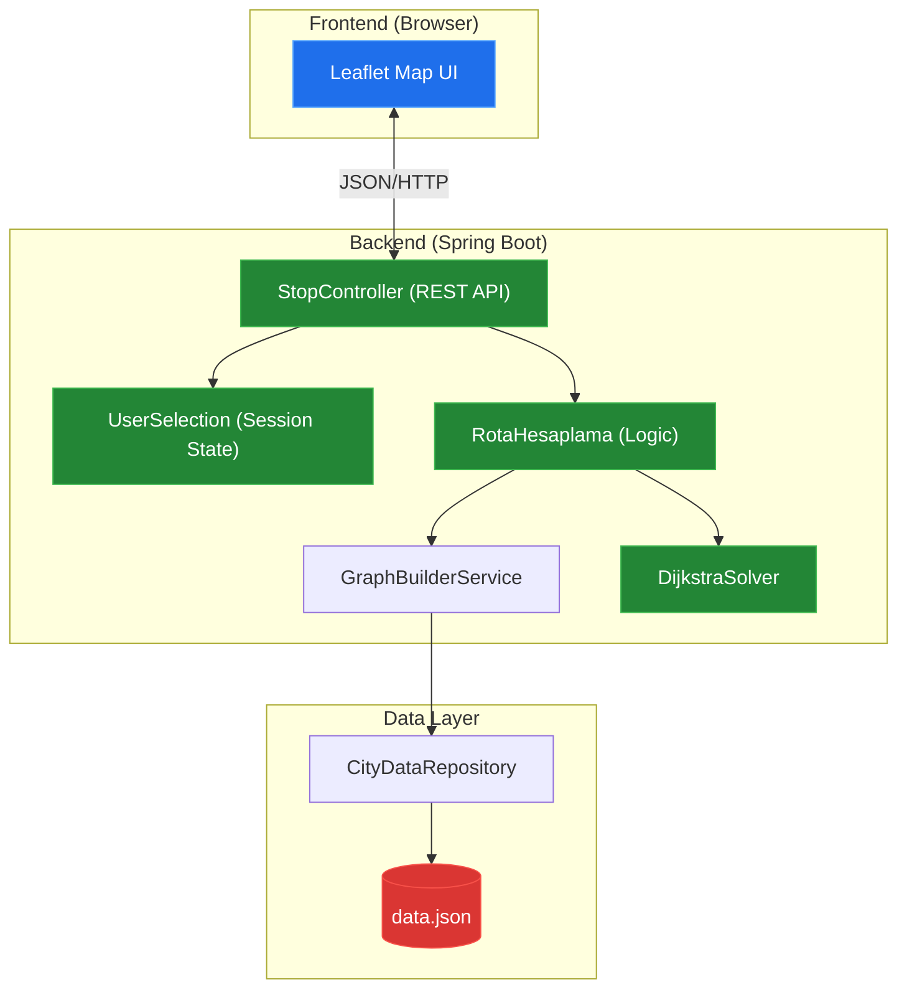
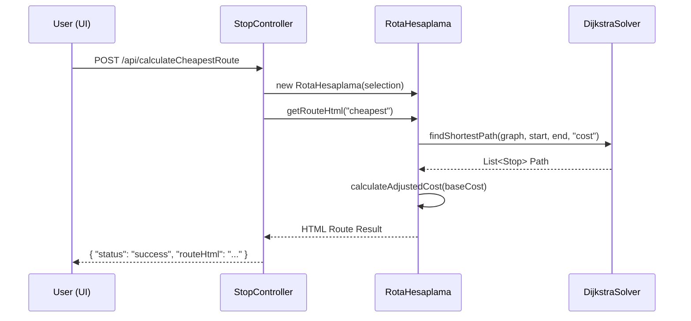
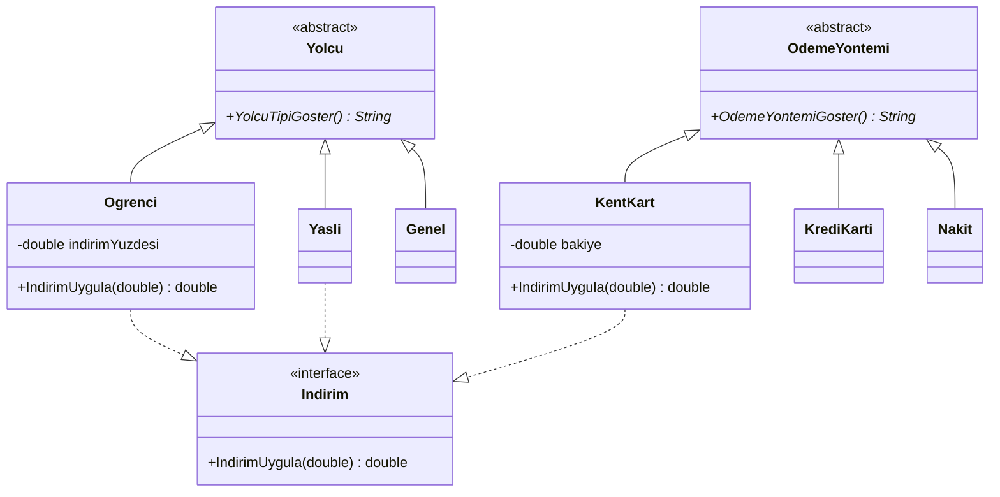
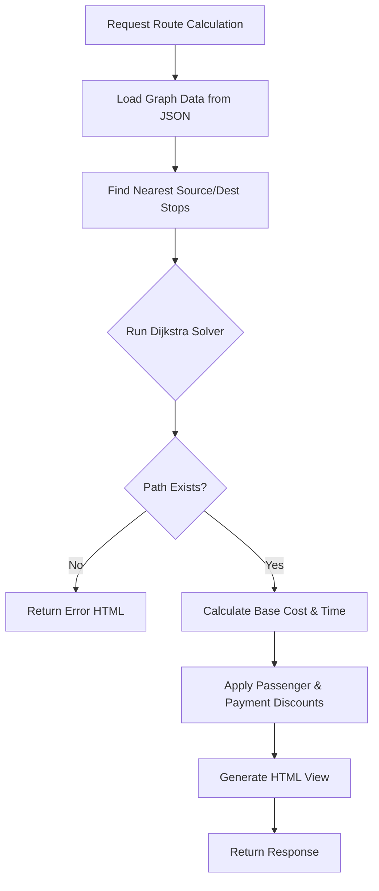

# System Blueprint: YusuffBulbul/Izmit_sehir_ici_ulasim

> Architecture and code review analysis
>
> Auto-generated on 2026-09-09 by Repo-to-Blueprint Architect

# English Version

## Project Purpose

The project is a public transportation route planning and payment simulation system for Izmit, Turkey. It allows users to select passenger types and payment methods, set origin and destination points on a map, and calculate optimal routes based on cost, time, or distance using bus, tram, and taxi options.

## Technical Stack

*   **Language**: Java
*   **Framework**: Spring Boot 3.1.2
*   **Key Dependencies**:
    *   `org.jgrapht:jgrapht-core:1.5.1` (Graph data structures)
    *   `com.google.code.gson:gson:2.8.9` (JSON parsing)
    *   `spring-boot-starter-web` (REST API)
    *   `Leaflet.js` (Frontend mapping library, via `index.html`)
*   **Infrastructure**: Maven (build system)

## Use Case Diagram

Evidence: `src/main/resources/static/index.html`, `src/main/java/com/example/StopController.java`

## System Architecture / Component Diagram

Evidence: `src/main/java/com/example/StopController.java`, `src/main/java/com/example/CityDataRepository.java`, `src/main/java/com/example/UserSelection.java`

## Sequence Diagram

Evidence: `src/main/java/com/example/StopController.java`, `src/main/java/com/example/RotaHesaplama.java`, `src/main/java/com/example/DijkstraSolver.java`

## Class Diagram

Evidence: `src/main/java/com/example/Yolcu.java`, `src/main/java/com/example/OdemeYontemi.java`, `src/main/java/com/example/Indirim.java`

## Activity Diagram / Flowchart

Evidence: `src/main/java/com/example/RotaHesaplama.java`, `src/main/java/com/example/DijkstraSolver.java`

## Evidence-Based Risks

1.  **UI/Logic Coupling**: UI HTML strings are constructed directly within Java methods, making the application hard to maintain and localize. (`src/main/java/com/example/RotaHesaplama.java`)
2.  **Lack of Input Validation**: REST endpoints accept latitude and longitude coordinates without range or type validation. (`src/main/java/com/example/StopController.java`)
3.  **Thread Safety/State Management**: `UserSelection` is `@SessionScope`, but manual graph building occurs per request, which may lead to performance bottlenecks. (`src/main/java/com/example/StopController.java`)

## Code Review

### Priority Summary

| ID | Priority | Category | Technical Debt | Evidence | Impact | Recommended Action |
| :--- | :--- | :--- | :--- | :--- | :--- | :--- |
| ARC-01 | P1 | Architecture | Tight coupling between Logic and View | `RotaHesaplama.java` (HTML hardcoded in methods) | Difficult to change UI or support mobile clients. | Use a template engine (Thymeleaf) or return DTOs. |
| STA-01 | P2 | Static Analysis | Catch-all Exception handling | `RotaHesaplama.java`, `StopController.java` | Masked bugs and difficulty in debugging production issues. | Catch specific exceptions and use a Global Exception Handler. |
| TEC-01 | P2 | Technology | Duplicate Graph implementation | `pom.xml` (jgrapht) vs `ManualGraph.java` | Maintenance overhead of custom Dijkstra logic. | Replace `ManualGraph` and `DijkstraSolver` with JGraphT. |
| SEC-01 | P2 | Security | Missing REST input validation | `StopController.java` (`@RequestBody Map`) | Potential for malformed data or DoS through invalid coordinates. | Use POJOs with Bean Validation (`@NotNull`, `@Min`, `@Max`). |
| STA-02 | P3 | Static Analysis | Hardcoded business rules | `Taxi.java` (fees), `Yolcu.java` (discounts) | Requires re-compilation for fare or discount changes. | Move pricing parameters to `application.properties` or `data.json`. |

### Static Analysis

*   [P2] [STA-01] The code frequently uses `try-catch (Exception e)` with `e.printStackTrace()`, which suppresses specific error contexts. (`src/main/java/com/example/RotaHesaplama.java`)
*   [P3] [STA-02] Business constants like `openingFee = 10.0` or `indirimYuzdesi = 0.50` are hardcoded in class files. (`src/main/java/com/example/Taxi.java`, `src/main/java/com/example/Yolcu.java`)

### Security

*   [P2] [SEC-01] Coordinates sent to `/api/setStartPoint` are taken directly from a map without verifying if they are within valid geographic bounds. (`src/main/java/com/example/StopController.java`)

### Architecture

*   [P1] [ARC-01] The `RotaHesaplama` class violates the Single Responsibility Principle by calculating routes AND generating large blocks of HTML strings. (`src/main/java/com/example/RotaHesaplama.java`)

### Technology

*   [P2] [TEC-01] JGraphT is included in `pom.xml`, but the project uses a custom `ManualGraph` and `DijkstraSolver` implementation, leading to redundant code. (`pom.xml`, `src/main/java/com/example/DijkstraSolver.java`)

---

## Repository Stats
| Metric | Value |
|---|---|
| Total Files | 41 |
| Total Directories | 11 |
| Generated | 2026-09-09 |
| Source | [YusuffBulbul/Izmit_sehir_ici_ulasim](https://github.com/YusuffBulbul/Izmit_sehir_ici_ulasim) |

---

*Repo-to-Blueprint Architect via n8n*
