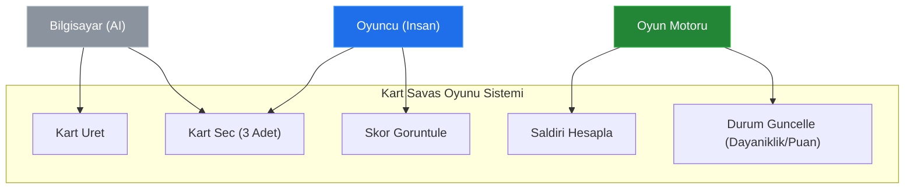
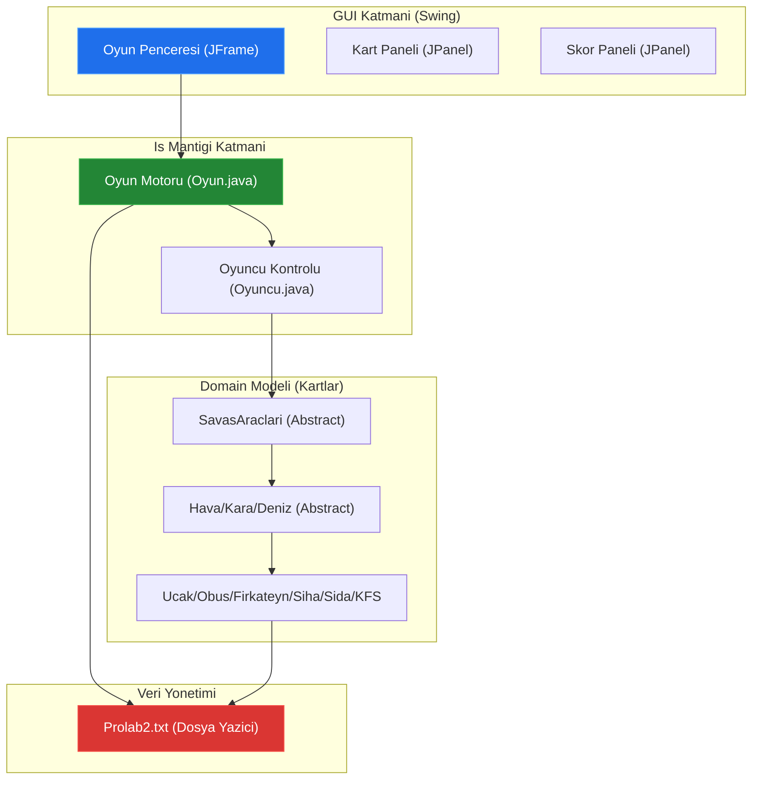
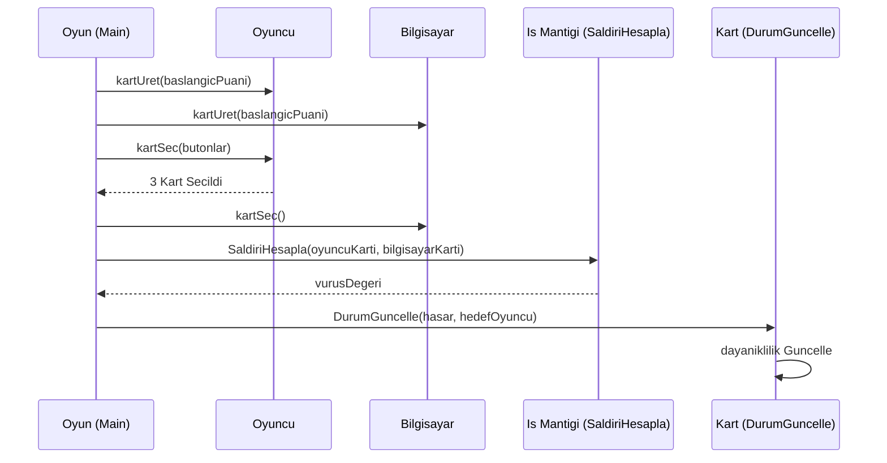
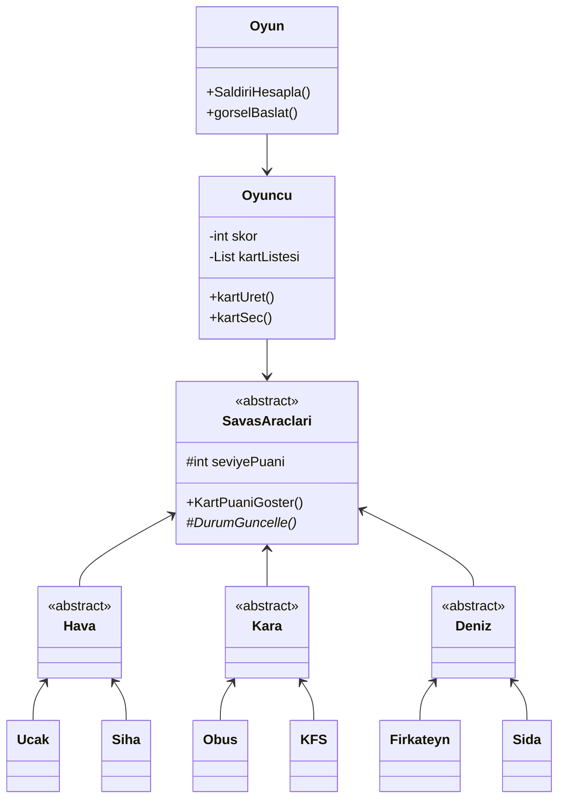
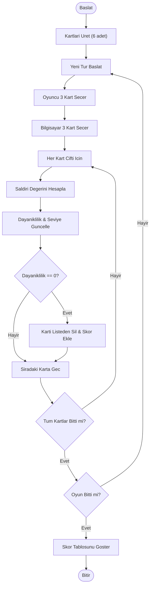

# Sistem Mimarisi: YusuffBulbul/Java-Kart-Sava-Oyunu

> Mimari analiz ve code review
>
> 2026-09-09 tarihinde Repo-to-Blueprint Architect tarafından otomatik oluşturuldu

# Türkçe Sürüm

## Proje Amacı

Bu proje, oyuncu ve bilgisayar arasında geçen askeri birim temalı bir kart savaşı oyunudur. Oyuncular hava, kara ve deniz araçlarını temsil eden kartları (`Ucak`, `Obus`, `Firkateyn`, `Siha`, `Sida`, `KFS`) kullanarak stratejik hamleler yapar, rakibin kart dayanıklılığını düşürür ve puan kazanır.

## Teknik Yığın

* **Dil**: Java
* **Framework**: Java Swing (GUI için)
* **Key Dependencies**: `java.util`, `javax.swing`, `java.awt`, `java.io`
* **Altyapı**: Dosya tabanlı günlükleme (Logging) sistemi (`Prolab2.txt`)

## Kullanım Senaryosu Diyagramı

Kanıt: `230202050_230205058/Oyun.java`, `230202050_230205058/Oyuncu.java`

## Sistem Mimarisi / Bileşen Diyagramı

Kanıt: `230202050_230205058/SavasAraclari.java`, `230202050_230205058/Oyun.java`, `230202050_230205058/Ucak.java`

## Sıralama Diyagramı

Kanıt: `230202050_230205058/Oyun.java` (main metodundaki döngü ve metod çağrıları)

## Sınıf Diyagramı

Kanıt: `230202050_230205058/SavasAraclari.java`, `230202050_230205058/Ucak.java`, `230202050_230205058/Oyuncu.java`

## Aktivite Diyagramı / Akış Şeması

Kanıt: `230202050_230205058/Oyun.java` içindeki `main` metodu döngü yapısı.

## Kanıta Dayalı Riskler

1. **Sabit Dosya Yolları (Portabilite Riski)**: Kod içerisinde `C:\Users\yusuf\OneDrive\Masaüstü\...` şeklinde sabit dosya yolları kullanılmıştır. Bu, uygulamanın farklı bilgisayarlarda çalışmasını engeller. (Kanıt: `Firkateyn.java`, `Oyun.java`, `Oyuncu.java`)
2. **Kod Tekrarı (Bakım Riski)**: `DurumGuncelle` metodu neredeyse tüm somut sınıflarda (`Ucak`, `Obus`, `Sida` vb.) %90 oranında aynı mantığı tekrar etmektedir. (Kanıt: `Ucak.java` satır 67-150 ve `KFS.java` satır 90-170 karşılaştırması)
3. **GUI Bloklama (Performans Riski)**: `Oyuncu.java` içerisindeki `kartSec` metodunda `Thread.sleep(100)` kullanılarak bir `while` döngüsü ile seçim beklenmektedir. Bu, Event Dispatch Thread'i (EDT) doğru yönetmezse arayüzün donmasına sebep olabilir. (Kanıt: `Oyuncu.java` satır 427)

## Code Review

### Öncelik Özeti

| ID | Öncelik | Kategori | Teknik Borç | Kanıt | Etki | Önerilen Aksiyon |
| :--- | :--- | :--- | :--- | :--- | :--- | :--- |
| SEC-01 | P0 | Güvenlik | Hardcoded Mutlak Dosya Yolları | `Oyun.java`, `Ucak.java` (Çoklu satır) | Uygulama Yusuf'un bilgisayarı dışında çalışmaz. | Relatif yollar veya `System.getProperty("user.dir")` kullanın. |
| ARC-01 | P1 | Mimari | Mantık ve Arayüz Sıkı Bağlılığı (Coupling) | `Oyuncu.java` (Swing importları ve logic iç içe) | Test edilebilirlik sıfır, UI değişikliği tüm sistemi bozar. | Controller sınıfı oluşturup Swing bileşenlerini mantıktan ayırın. |
| STA-01 | P2 | Statik Analiz | Aşırı Kod Tekrarı (DRY İhlali) | Tüm `DurumGuncelle` implementasyonları | Bakım zorluğu; bir kural değiştiğinde 6-7 dosyada değişim gerekir. | Ortak mantığı `SavasAraclari.java` içinde genel bir metoda taşıyın. |
| TEC-01 | P3 | Teknoloji | Yanlış Event Handling | `Oyuncu.java` satır 427 (`Thread.sleep`) | Arayüz kararsızlığı ve CPU israfı. | `CountDownLatch` veya `ActionListener` callback yapısı kullanın. |

### Statik Analiz

* **P2 | STA-01**: `DurumGuncelle` metodu, `Ucak`, `Obus`, `Firkateyn`, `Siha`, `Sida` ve `KFS` sınıflarında kopyala-yapıştır mantığıyla çoğaltılmıştır. Bu durum, oyun kurallarında yapılacak küçük bir değişikliğin her sınıfa manuel olarak uygulanmasını gerektirir.

### Güvenlik

* **P0 | SEC-01**: `Prolab2.txt` dosyasına ve resim dosyalarına erişim için kullanılan mutlak yollar (`C:\Users\yusuf\...`), dosya sistemine dair hassas bilgileri sızdırır ve uygulamanın dağıtılabilirliğini yok eder.

### Mimari

* **P1 | ARC-01**: `Oyuncu` sınıfı hem veri modelini (skor, kart listesi) hem de arayüz etkileşimini (buton tıklamaları, JOptionPane) yönetmektedir. Single Responsibility Principle (SRP) ihlal edilmiştir.

### Teknoloji

* **P3 | TEC-01**: Kullanıcı etkileşimini beklemek için `Thread.sleep` içeren bir döngü kullanımı Java Swing standartlarına aykırıdır. Bu yaklaşım, modern asenkron programlama teknikleri yerine ilkel bir bloklama yöntemi tercih edildiğini gösterir.

---

## Depo İstatistikleri
| Metrik | Değer |
|---|---|
| Toplam Dosya | 27 |
| Toplam Dizin | 2 |
| Oluşturulma | 2026-09-09 |
| Kaynak | [YusuffBulbul/Java-Kart-Sava-Oyunu](https://github.com/YusuffBulbul/Java-Kart-Sava-Oyunu) |

---

*Repo-to-Blueprint Architect via n8n*
