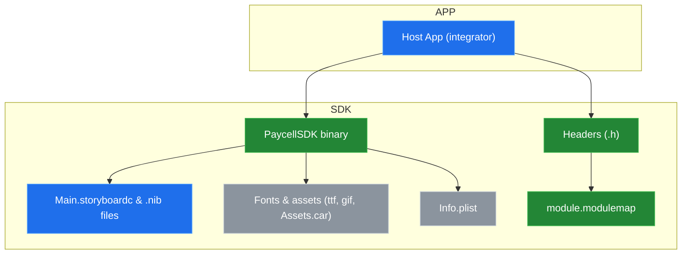
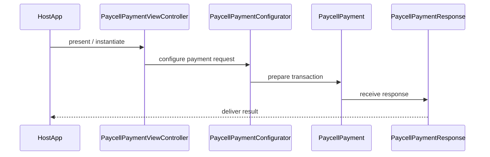

# System Blueprint: Turkcell/PaycellSDK-iOS

> Architecture and code review analysis
>
> Auto-generated on 2026-09-07 by Repo-to-Blueprint Architect

# English Version

## Project Purpose
This repository contains an iOS SDK distributed as a compiled framework named PaycellSDK.framework. The framework exposes Objective-C headers for payment-related components (e.g., PaycellPaymentViewController, PaycellPayment, PaycellPaymentConfigurator, PaycellPaymentResponse) and includes UI resources (storyboards/nibs), fonts, and assets.

## Technical Stack
- **Language**: Objective-C (evidence: Frameworks/PaycellSDK.framework/Headers/*.h)
- **Framework**: CocoaPods (evidence: PaycellSDK.podspec present at repository root)
- **Key Dependencies**: None declared in accessible dependency files in the provided repository evidence
- **Infrastructure**:

## Architecture Blueprint

## Request Flow

(Participants referenced from headers: Frameworks/PaycellSDK.framework/Headers/PaycellPaymentViewController.h, PaycellPaymentConfigurator.h, PaycellPayment.h, PaycellPaymentResponse.h)

## Evidence-Based Risks
1. Closed-source binary distribution: Frameworks/PaycellSDK.framework/PaycellSDK is a compiled binary while only headers are present (Frameworks/PaycellSDK.framework/Headers/*.h). This prevents direct source-level inspection or instrumentation by integrators.
2. Embedded UI and assets inside the framework: Many storyboard/nib files and fonts live inside the framework (Frameworks/PaycellSDK.framework/Main.storyboardc/* and multiple .nib and .ttf files), indicating the SDK includes opinionated UI that may be hard to theme or replace.
3. Lack of observable tests or example integrations: Repository contains no Example/, Demo/, or Tests/ directories, and only the framework artifacts and podspec are present, which reduces ease of validation and integration testing.

## Code Review

### Priority Summary
| ID | Priority | Category | Technical Debt | Evidence | Impact | Recommended Action |
|---|---:|---|---|---|---|---|
| [ARC-01] | P1 | Architecture | Binary-only SDK distribution restricts auditability and debugging | Frameworks/PaycellSDK.framework/PaycellSDK and Frameworks/PaycellSDK.framework/Headers/*.h | Integrators cannot inspect implementation, debug into SDK, or apply fixes; harder security review and instrumentation | Provide source (or an open-source variant), ship dSYMs and symbol maps, or publish audited source/API reference and change log in repo |
| [ARC-02] | P1 | Architecture | SDK embeds UI resources and fonts inside framework, causing tight coupling to UI | Frameworks/PaycellSDK.framework/Main.storyboardc/*, Frameworks/PaycellSDK.framework/*.nib, Frameworks/PaycellSDK.framework/*.ttf | Limits host app customization, possible style conflicts, larger app bundle size | Document theming/customization hooks, expose UI customization APIs, or separate UI resources into optional resource bundle |
| [STA-01] | P2 | Static Analysis | No visible tests or example app reduces testability and integration validation | Repository tree lacks Example/, Demo/, or Tests/ directories (root listing) | Harder for integrators to validate behavior and regressions before release | Add unit tests, and a minimal example app or integration guide in the repository |
| [TEC-01] | P2 | Technology | Module map and Objective-C headers present but no documented Swift interoperability guidance | Frameworks/PaycellSDK.framework/Modules/module.modulemap and Frameworks/PaycellSDK.framework/Headers/*.h | Swift projects may require bridging and integration instructions; potential friction for Swift-only consumers | Publish Swift compatibility notes, provide a Swift module interface or XCFramework with module stability, and add integration snippets in README |
| [ARC-03] | P3 | Architecture | Info.plist in framework present without documented required host configuration | Frameworks/PaycellSDK.framework/Info.plist and PaycellSDK.podspec | Host apps may need to add entitlements, URL schemes, or Info.plist keys without guidance | Document any required Info.plist keys or entitlements in README and podspec notes |

### Static Analysis
- [P2] STA-01: No visible automated tests or sample integration projects. Evidence: repository root contains no Example/, Demo/, or Tests/ directories; primary contents are Frameworks/PaycellSDK.framework and metadata files (README.md, PaycellSDK.podspec).

### Security
- No evidence-backed technical debt found

### Architecture
- [P1] ARC-01: Binary-only SDK distribution (Frameworks/PaycellSDK.framework/PaycellSDK) with only headers available (Frameworks/PaycellSDK.framework/Headers/*.h) limits auditability, debugging, and instrumentation.
- [P1] ARC-02: Embedded UI/resources in the framework (Frameworks/PaycellSDK.framework/Main.storyboardc/*, .nib files, .ttf fonts, Assets.car) indicate tight UI coupling that reduces host app theming and flexibility.
- [P3] ARC-03: Presence of an Info.plist in the framework (Frameworks/PaycellSDK.framework/Info.plist) suggests runtime configuration keys may be required; repository lacks documentation of any required host-side Info.plist keys or entitlements (README.md and PaycellSDK.podspec present but contents not providing documented keys in visible tree).

### Technology
- [P2] TEC-01: module.modulemap exists (Frameworks/PaycellSDK.framework/Modules/module.modulemap) alongside Objective-C headers (Frameworks/PaycellSDK.framework/Headers/*.h). There is no accompanying visible guidance for Swift interoperability or ABI/module-stability in the repository.

---

# Türkçe Sürüm

## Proje Amacı
Bu depo, PaycellSDK.framework adlı derlenmiş bir iOS SDK'sı içerir. SDK, ödeme ile ilgili bileşenler için Objective-C başlıkları (ör. PaycellPaymentViewController, PaycellPayment, PaycellPaymentConfigurator, PaycellPaymentResponse) ve storyboard/nib UI kaynakları, fontlar ve varlıklar sağlar.

## Teknik Yığın
- **Dil**: Objective-C (kanıt: Frameworks/PaycellSDK.framework/Headers/*.h)
- **Framework**: CocoaPods (kanıt: PaycellSDK.podspec depoda mevcut)
- **Temel Bağımlılıklar**: Sağlanan bağımlılık dosyalarında açıkça listelenmiş bir bağımlılık bulunmamaktadır
- **Altyapı**:

## Mimari Plan

## İstek Akışı

(Parçalar şu başlıklardan alınmıştır: Frameworks/PaycellSDK.framework/Headers/PaycellPaymentViewController.h, PaycellPaymentConfigurator.h, PaycellPayment.h, PaycellPaymentResponse.h)

## Kanıta Dayalı Riskler
1. Kapalı kaynak ikili dağıtım: Frameworks/PaycellSDK.framework/PaycellSDK bir derlenmiş ikili olup yalnızca başlıklar sağlanmaktadır (Frameworks/PaycellSDK.framework/Headers/*.h). Bu, kaynak düzeyinde inceleme ve hata ayıklamayı engeller.
2. Framework içinde gömülü UI ve varlıklar: Birçok storyboard/nib ve font framework içinde yer alır (Frameworks/PaycellSDK.framework/Main.storyboardc/*, .nib, .ttf dosyaları), bu da SDK'nın güçlü şekilde UI'ye bağlı olduğunu gösterir.
3. Görünür test veya örnek entegrasyon eksikliği: Depoda Example/, Demo/ veya Tests/ dizinleri yok; yalnızca framework artefaktları ve podspec bulunuyor; bu durum entegrasyon doğrulamasını zorlaştırır.

## Code Review

### Öncelik Özeti
| ID | Öncelik | Kategori | Teknik Borç | Kanıt | Etki | Önerilen Aksiyon |
|---|---:|---|---|---|---|---|
| [ARC-01] | P1 | Mimari | Yalnızca ikili (binary) SDK dağıtımı inceleme ve hata ayıklamayı kısıtlıyor | Frameworks/PaycellSDK.framework/PaycellSDK ve Frameworks/PaycellSDK.framework/Headers/*.h | Entegratörler implementasyonu inceleyemez, hata ayıklama ve güvenlik denetimi zorlaşır | Kaynak kod sağlanması veya dSYM/simbol haritaları eklenmesi; API açıklamaları ve değişiklik günlüğü yayımlanması |
| [ARC-02] | P1 | Mimari | SDK, storyboard/nib ve fontları framework içinde gömülü olarak sunuyor, bu UI sıkı bağlılığına neden oluyor | Frameworks/PaycellSDK.framework/Main.storyboardc/*, .nib, .ttf dosyaları | Ev sahibi uygulamanın özelleştirme imkânı kısıtlanır ve paket boyutu artar | Tema/özelleştirme API'leri dokümante edin, UI özelleştirme kılavuzu veya opsiyonel kaynak paketi sunun |
| [STA-01] | P2 | Statik Analiz | Görünür bir test veya örnek uygulama yok, test edilebilirlik azalıyor | Depo kökünde Example/, Demo/ veya Tests/ dizini yok | Entegrasyon doğrulaması ve regresyon testleri zorlaşır | Unit testleri ve örnek bir entegrasyon uygulaması ekleyin |
| [TEC-01] | P2 | Teknoloji | module.modulemap ve Objective-C başlıkları var ancak Swift uyumluluğu için dokümantasyon yok | Frameworks/PaycellSDK.framework/Modules/module.modulemap ve Frameworks/PaycellSDK.framework/Headers/*.h | Swift projelerinde köprüleme gerektirebilir; entegrasyon sürtüşmesi | Swift uyumluluğu için yönergeler, Swift modülü veya stabillik notları ekleyin |
| [ARC-03] | P3 | Mimari | Framework içinde Info.plist mevcut fakat depo içinde gerekli host yapılandırması belgelenmemiş | Frameworks/PaycellSDK.framework/Info.plist ve PaycellSDK.podspec | Host uygulama tarafından eklenmesi gereken Info.plist anahtarları/izinler belirsiz | Gerekli Info.plist anahtarlarını ve yetkilendirmeleri README veya podspec içinde belgeleyin |

### Statik Analiz
- [P2] STA-01: Depoda otomatik testler veya örnek entegrasyon projesi bulunmuyor. Kanıt: depo kökünde yalnızca Frameworks/PaycellSDK.framework ve meta dosyalar (README.md, PaycellSDK.podspec) yer alıyor; Example/ veya Tests/ dizinleri yok.

### Güvenlik
- Kanıta dayalı teknik borç bulunamadı

### Mimari
- [P1] ARC-01: Yalnızca derlenmiş ikili SDK (Frameworks/PaycellSDK.framework/PaycellSDK) ve başlıklar (Frameworks/PaycellSDK.framework/Headers/*.h) mevcut; bu durum denetlenebilirliği ve hata ayıklamayı kısıtlıyor.
- [P1] ARC-02: Framework içinde yer alan storyboard, nib ve fontlar (Frameworks/PaycellSDK.framework/Main.storyboardc/*, .nib, .ttf) SDK'nın UI'ye sıkı bağlı olduğunu gösteriyor; özelleştirme zorluğu oluşabilir.
- [P3] ARC-03: Framework Info.plist dosyası mevcut (Frameworks/PaycellSDK.framework/Info.plist) ancak depo içinde bu dosyada yer alan veya host uygulamada gerekli olabilecek anahtarlar için açık dokümantasyon bulunmuyor (README.md ve PaycellSDK.podspec mevcut fakat açık Info.plist gereksinimleri görünür değil).

### Teknoloji
- [P2] TEC-01: Frameworks/PaycellSDK.framework/Modules/module.modulemap ve Frameworks/PaycellSDK.framework/Headers/*.h var; depoda Swift uyumluluğu veya modül stabilitesi hakkında rehberlik yer almıyor, bu da Swift projelerinde entegrasyon sürtüşmesine yol açabilir.

---

## Repository Stats
| Metric | Value |
|---|---|
| Total Files | 70 |
| Total Directories | 5 |
| Generated | 2026-09-07 |
| Source | [Turkcell/PaycellSDK-iOS](https://github.com/Turkcell/PaycellSDK-iOS) |

---

*Repo-to-Blueprint Architect via n8n*
