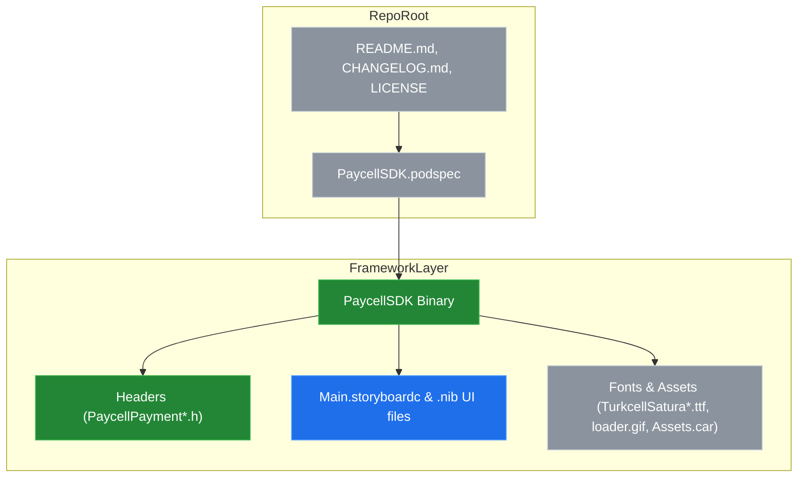
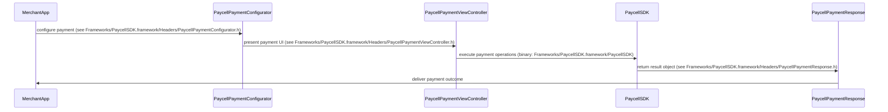

# System Blueprint: Turkcell/PaycellSDK-iOS

> Architecture and code review analysis
>
> Auto-generated on 2026-09-07 by Repo-to-Blueprint Architect

# English Version

## Project Purpose
This repository packages an iOS payment SDK named Paycell as a compiled framework for integration into iOS apps. Evidence: Frameworks/PaycellSDK.framework (binary and Headers such as Frameworks/PaycellSDK.framework/Headers/PaycellPaymentViewController.h, Frameworks/PaycellSDK.framework/Headers/PaycellPayment.h).

## Technical Stack
- **Language**: Objective-C (repository primary language; framework exposes Objective-C headers under Frameworks/PaycellSDK.framework/Headers)
- **Framework**: CocoaPods packaging indicated (PaycellSDK.podspec exists at repository root)
- **Key Dependencies**: No dependency declarations were found in the provided dependency files (no requirements.txt, package.json, Cargo.toml, go.mod, pyproject.toml); only PaycellSDK.podspec is present (contents not provided).
- **Infrastructure**: (none)

## Architecture Blueprint

## Request Flow

## Evidence-Based Risks
1. Repository contains only a compiled binary plus headers (Frameworks/PaycellSDK.framework/PaycellSDK and Frameworks/PaycellSDK.framework/Headers/*), preventing source-level review or instrumentation.
2. Significant UI resources are embedded inside the framework (Frameworks/PaycellSDK.framework/Main.storyboardc/*.nib and Frameworks/PaycellSDK.framework/*.nib), which can increase app bundle size and create resource-name collision risk.
3. Packaging metadata exists via PaycellSDK.podspec at repository root, but no other dependency manifests were provided to clarify external requirements (only PaycellSDK.podspec present).

---

## Code Review

### Priority Summary
| ID | Priority | Category | Technical Debt | Evidence | Impact | Recommended Action |
|---|---:|---|---|---|---|---|
| SEC-01 | P1 | Security | Closed-source binary prevents audit | Frameworks/PaycellSDK.framework/PaycellSDK and Frameworks/PaycellSDK.framework/Headers/* | Limits ability to perform security review, memory/sanitizer analysis, or patch vulnerabilities | Provide source, symbolicated debug builds, or detailed security/cryptography documentation and vulnerability disclosure process |
| ARC-02 | P2 | Architecture | UI and resource bundling inside framework leads to coupling and bundle bloat | Frameworks/PaycellSDK.framework/Main.storyboardc/*.nib and Frameworks/PaycellSDK.framework/*.nib and fonts (Frameworks/PaycellSDK.framework/TurkcellSatura*.ttf) and Assets.car | Increased app size, potential resource collisions, reduced flexibility for integrators | Document resource usage, namespace resources, or offer a variant without embedded UI/resources |
| TEC-03 | P2 | Technology | Packaging metadata present but integration clarity incomplete | PaycellSDK.podspec at repo root; no other manifest files (no Package.swift, no Cartfile) | Unclear integration options beyond CocoaPods; integrators may lack examples for SPM/Carthage | Include explicit integration docs and sample Podfile/Package.swift or multi-format packaging metadata |
| STA-04 | P3 | Static Analysis | No tests or source-level code to run unit/integration tests present | Repository tree contains framework and docs but no tests directory or source files (only Frameworks/PaycellSDK.framework, README.md, CHANGELOG.md, LICENSE) | Low traceability for regressions; integrators cannot run SDK tests locally | Add test projects or provide source examples and unit/integration test suites or test harnesses for the SDK |

### Static Analysis
- [P3] STA-04 — Evidence: repository contains only precompiled framework and headers (Frameworks/PaycellSDK.framework) and no test artifacts or source folders visible in the repository root (README.md, CHANGELOG.md, LICENSE only). Impact: inability to run unit tests or static analysis on SDK internals. Recommendation: publish tests or sample apps/source to enable local verification.

### Security
- [P1] SEC-01 — Evidence: compiled binary present at Frameworks/PaycellSDK.framework/PaycellSDK and only headers in Frameworks/PaycellSDK.framework/Headers. Impact: security review/forensics of implementation, memory safety, and vulnerability scanning is blocked. Recommendation: provide source, symbol files, or a documented security assessment and a disclosure/contact policy.

### Architecture
- [P2] ARC-02 — Evidence: Framework bundles many compiled UI resources (Frameworks/PaycellSDK.framework/Main.storyboardc/*.nib, multiple .nib files in Frameworks/PaycellSDK.framework, fonts under Frameworks/PaycellSDK.framework/TurkcellSatura*.ttf). Impact: tight coupling of UI to SDK, increased binary size, potential naming collisions with host app resources. Recommendation: document resource names and usage, namespace resource identifiers, or provide a headless/core-only SDK variant.

### Technology
- [P2] TEC-03 — Evidence: PaycellSDK.podspec exists at repository root (PaycellSDK.podspec) suggesting CocoaPods distribution; repository lacks other manifest files (no Package.swift, Cartfile, etc.). Impact: integrators uncertain about supported package managers and dependency requirements. Recommendation: include explicit integration instructions for CocoaPods and optionally SPM/Carthage metadata or examples.

---

## Repository Stats
| Metric | Value |
|---|---|
| Total Files | 70 |
| Total Directories | 5 |
| Generated | 2026-09-07 |
| Source | [Turkcell/PaycellSDK-iOS](https://github.com/Turkcell/PaycellSDK-iOS) |

---

*Repo-to-Blueprint Architect via n8n*
