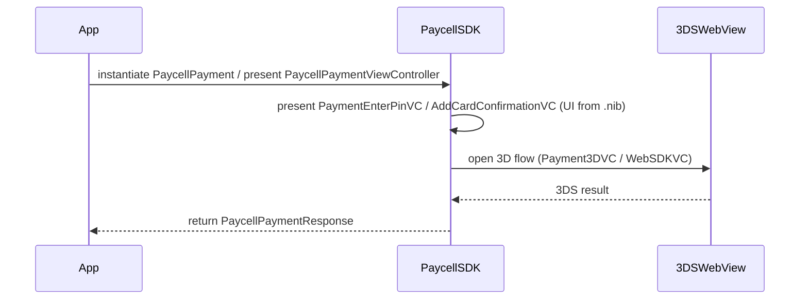

# System Blueprint: Turkcell/PaycellSDK-iOS

> Architecture and code review analysis
>
> Auto-generated on 2026-09-07 by Repo-to-Blueprint Architect

# English Version

## Project Purpose
This repository contains an iOS binary SDK distribution (PaycellSDK) for handling payments and payment-related UI flows (3D Secure, PIN entry, add-card confirmation), delivered as a prebuilt .framework with public headers and UI resources.

## Technical Stack
- **Language**: Objective-C (inferred from .framework and .h headers)
- **Framework**: CocoaPods packaging indicated by PaycellSDK.podspec at repository root
- **Key Dependencies**: No explicit libraries listed in visible dependency files. (A PaycellSDK.podspec file exists, but its dependency contents are not provided in the repository evidence.)
- **Infrastructure**:

## Architecture Blueprint

```mermaid
flowchart TD
subgraph SDKFramework
SDKBin["PaycellSDK Binary"]
Headers["Public Headers"]
Nibs["UI NIBs / Storyboards"]
end
subgraph Resources
Assets["Assets.car"]
Fonts["Embedded TTF fonts"]
end
App["Host App"]["Service"]
App --> SDKBin
SDKBin --> Headers
SDKBin --> Nibs
Nibs --> Assets
SDKBin --> Fonts
style SDKBin fill:#1f6feb,stroke:#58a6ff,color:#fff
style Headers fill:#238636,stroke:#3fb950,color:#fff
style Assets fill:#da3633,stroke:#f85149,color:#fff
style Fonts fill:#8b949e,stroke:#c9d1d9,color:#fff

```

## Request Flow



## Evidence-Based Risks
1. Binary-only distribution: repository contains a compiled framework (Frameworks/PaycellSDK.framework/PaycellSDK) with public headers (Frameworks/PaycellSDK.framework/Headers/*.h) but no SDK source — prevents source-level review of payment logic.
2. Monolithic packaging: UI resources (.nib), fonts (.ttf), assets (Assets.car) and compiled binary are bundled together in the framework (Frameworks/PaycellSDK.framework/*.nib, *.ttf, Assets.car, PaycellSDK), limiting modular reuse.
3. Integration ambiguity: repository includes a CocoaPods podspec (PaycellSDK.podspec) alongside a prebuilt framework (Frameworks/PaycellSDK.framework/), which can create uncertainty for integrators about whether they should use the binary, the podspec, or both.

## Code Review

### Priority Summary
| ID | Priority | Category | Technical Debt | Evidence | Impact | Recommended Action |
|---|---:|---|---|---|---|---|
| [SEC-01] | P1 | Security | Binary-only SDK prevents source audit of payment/security logic | Frameworks/PaycellSDK.framework/PaycellSDK and Frameworks/PaycellSDK.framework/Headers/*.h | Integrators and auditors cannot verify handling of sensitive payment data or crypto flows | Provide source or reproducible build instructions; publish security design notes and hardening/crypto details |
| [TEC-01] | P1 | Technology | Podspec + prebuilt framework may confuse integrators about package source | PaycellSDK.podspec and Frameworks/PaycellSDK.framework/ | Integration errors or inconsistent versions across integrations | Update podspec to clearly reference the binary (if intended) or publish source + podspec; add README explaining recommended integration path |
| [ARC-01] | P2 | Architecture | Monolithic resource+binary packaging increases coupling and limits selective reuse | Frameworks/PaycellSDK.framework/*.nib, *.ttf, Assets.car, PaycellSDK | Harder to reuse parts (UI vs core logic), larger binary size, limited modular updates | Split UI resources from core logic; consider providing a resource bundle and a separate binary or modular subspecs |
| [STA-01] | P2 | Static Analysis | No unit tests or example app present in repository (reduces testability) | Repository tree contains Frameworks/, PaycellSDK.podspec, README.md but no Tests/ or Example/ directories | Reduced confidence in behavior across versions; harder for integrators to verify integration | Add a sample app demonstrating integration and unit/integration tests in repo or linked examples |
| [STA-02] | P3 | Static Analysis | UI shipped as compiled .nib files (Main.storyboardc/*.nib) reduces readability of UI structure | Frameworks/PaycellSDK.framework/Main.storyboardc/*.nib | Makes visual diffing, review and small patching of UI harder for integrators | Consider including uncompiled storyboards/XIBs or design docs, or provide a human-readable representation for contributors |
| [TEC-02] | P3 | Technology | Embedded font files increase bundle size and require license/packaging attention | Frameworks/PaycellSDK.framework/*.ttf | Larger SDK binary; potential licensing or duplication issues in host apps | Document font licensing; consider optional resource bundle or system font fallbacks |

### Static Analysis
- P2 STA-01: repository contains no Tests/ or Example/ directories; only a prebuilt framework and packaging files are present (Frameworks/, PaycellSDK.podspec, README.md) — testability and integration verification debt.
- P3 STA-02: Many UI resources are provided as compiled .nib files (Frameworks/PaycellSDK.framework/Main.storyboardc/*.nib) which reduces source readability and makes UI diffs/patches difficult.

### Security
- P1 SEC-01: The SDK is delivered as a compiled binary (Frameworks/PaycellSDK.framework/PaycellSDK) with only public headers in Frameworks/PaycellSDK.framework/Headers/*.h. This prevents code-level auditing of payment and sensitive-data handling logic.

### Architecture
- P2 ARC-01: The framework bundles compiled UI, fonts, and assets together with the binary (Frameworks/PaycellSDK.framework/*.nib, *.ttf, Assets.car, PaycellSDK), indicating a monolithic packaging strategy that hinders modularity and selective updates.

### Technology
- P1 TEC-01: Presence of PaycellSDK.podspec alongside a prebuilt Frameworks/PaycellSDK.framework/ may create integration ambiguity. Evidence: PaycellSDK.podspec and Frameworks/PaycellSDK.framework/.
- P3 TEC-02: Embedded TTF fonts in the framework (Frameworks/PaycellSDK.framework/*.ttf) increase binary size and require explicit licensing/packaging consideration.

---

## Repository Stats
| Metric | Value |
|---|---|
| Total Files | 70 |
| Total Directories | 5 |
| Generated | 2026-09-07 |
| Source | [Turkcell/PaycellSDK-iOS](https://github.com/Turkcell/PaycellSDK-iOS) |

---

*Repo-to-Blueprint Architect via n8n*
