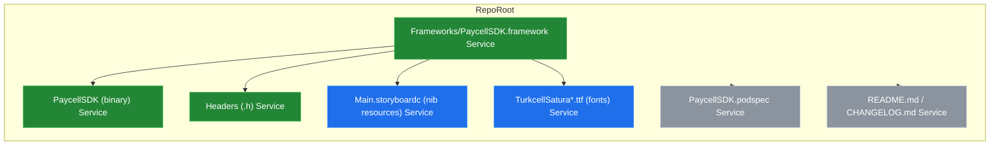
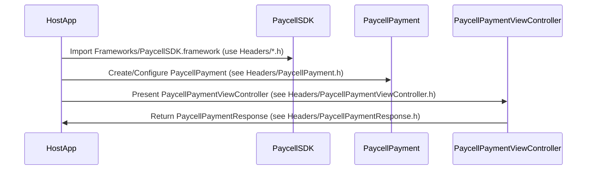

# System Blueprint: Turkcell/PaycellSDK-iOS

> Architecture and code review analysis
>
> Auto-generated on 2026-09-07 by Repo-to-Blueprint Architect

# English Version

## Project Purpose
This repository packages a prebuilt iOS SDK bundle named PaycellSDK for integration into iOS apps. Evidence: presence of Frameworks/PaycellSDK.framework and public headers such as Frameworks/PaycellSDK.framework/Headers/PaycellPayment.h and Frameworks/PaycellSDK.framework/Headers/PaycellPaymentViewController.h.

## Technical Stack
- **Language**: Objective-C (public headers in Frameworks/PaycellSDK.framework/Headers/*.h)
- **Framework**: CocoaPods (PaycellSDK.podspec present)
- **Key Dependencies**: No dependency libraries can be extracted from the repository evidence (podspec content not provided).
- **Infrastructure**: (none)

## Architecture Blueprint

## Request Flow

## Evidence-Based Risks
1. The SDK is distributed as a precompiled binary with only headers present (Frameworks/PaycellSDK.framework/PaycellSDK and Frameworks/PaycellSDK.framework/Headers/*.h). This prevents source-level inspection and unit testing of SDK internals.
2. The framework embeds multiple UI resources inside the bundle (Frameworks/PaycellSDK.framework/Main.storyboardc/*.nib and Frameworks/PaycellSDK.framework/*.ttf), which increases coupling to the host app UI and may complicate runtime theming or size optimization.
3. A podspec file exists (PaycellSDK.podspec) but its contents are not present in the provided evidence; no explicit dependency list can be confirmed from the repository evidence.

## Code Review

### Priority Summary
| ID | Priority | Category | Technical Debt | Evidence | Impact | Recommended Action |
|---|---:|---|---|---|---|---|
| [STA-01] | P2 | Static Analysis | Headers-only + binary distribution prevents source-level static analysis and unit testing | Frameworks/PaycellSDK.framework/PaycellSDK and Frameworks/PaycellSDK.framework/Headers/*.h | Limits ability to debug, profile, or run unit tests against SDK internals | Provide source distribution or a separately versioned open-source module, or publish symbols/documentation for better observability |
| [ARC-01] | P2 | Architecture | UI resources embedded inside binary increase coupling and bundle size | Frameworks/PaycellSDK.framework/Main.storyboardc/*.nib and Frameworks/PaycellSDK.framework/*.ttf | Larger SDK footprint; host apps cannot easily override UI or fonts | Provide customizable theming points, optional resource bundles, or document resource usage and extension points |
| [ARC-02] | P3 | Architecture | No example app or integration samples present in repo evidence | Absence of Example/ or Demo/ directories; only README.md and PaycellSDK.podspec at root | Slows new integrators and increases integration errors | Add a minimal Example app or integration snippets in README and a sample project directory |
| [TEC-01] | P3 | Technology | Packaging appears limited to CocoaPods (podspec present) with no other package manager manifests | PaycellSDK.podspec present; no Package.swift, Cartfile, or other package manager files in repo tree | Limits integration options for SwiftPM or Carthage users | Add support for Swift Package Manager (Package.swift) or document alternative installation methods |

### Static Analysis
- [P2] [STA-01] Headers-only + binary distribution — evidence: Frameworks/PaycellSDK.framework/PaycellSDK (binary) and Frameworks/PaycellSDK.framework/Headers/*.h. Description: no .m/.c/.swift sources in repository, limiting ability to run static analysis tools or unit tests on SDK code.

### Security
- No evidence-backed technical debt found

### Architecture
- [P2] [ARC-01] Embedded UI resources and fonts — evidence: Frameworks/PaycellSDK.framework/Main.storyboardc/*.nib and Frameworks/PaycellSDK.framework/TurkcellSatura*.ttf. Description: SDK bundles nib/storyboard and font assets inside the framework, increasing coupling and binary size.
- [P3] [ARC-02] No example/demo project — evidence: repository root contains README.md, CHANGELOG.md, PaycellSDK.podspec but no Example/ directory. Description: integration friction for SDK consumers.

### Technology
- [P3] [TEC-01] Packaging limited to CocoaPods manifest — evidence: PaycellSDK.podspec present; no other package manager manifests detected. Description: add alternative packaging or document supported installation methods.

---

## Repository Stats
| Metric | Value |
|---|---|
| Total Files | 70 |
| Total Directories | 5 |
| Generated | 2026-09-07 |
| Source | [Turkcell/PaycellSDK-iOS](https://github.com/Turkcell/PaycellSDK-iOS) |

---

*Repo-to-Blueprint Architect via n8n*
