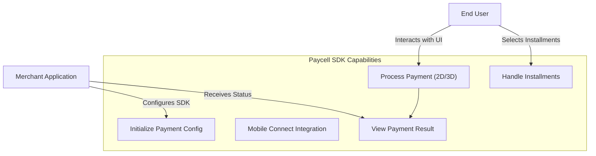
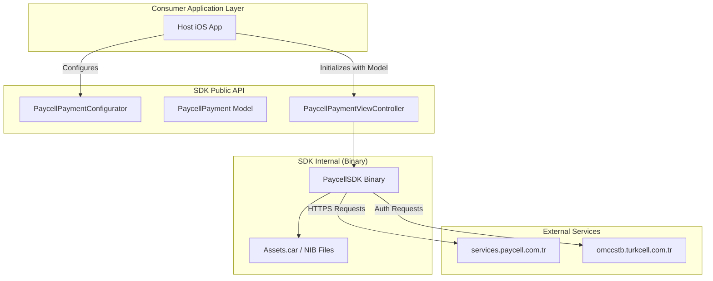
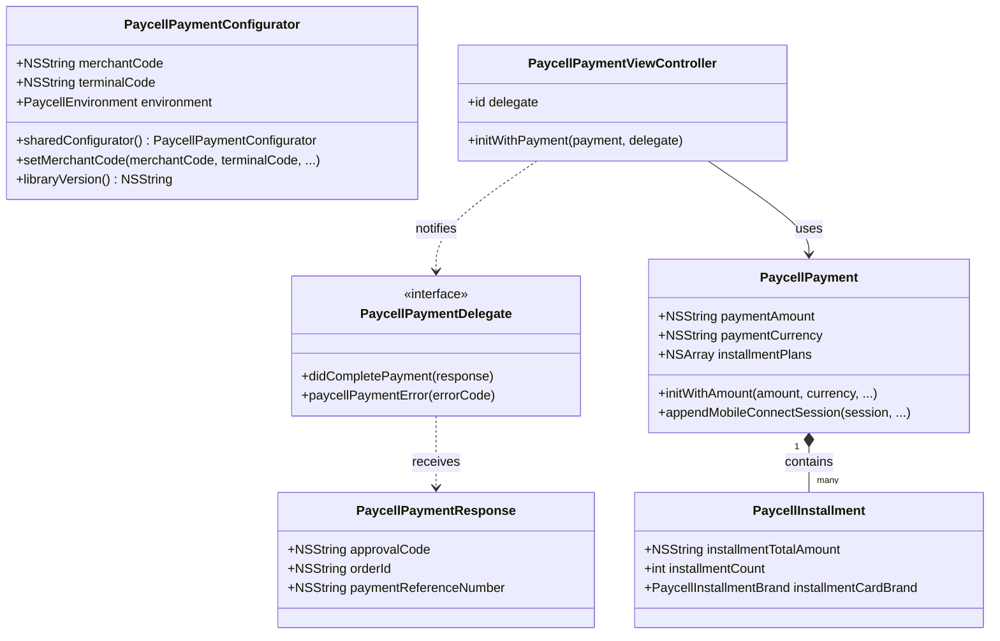
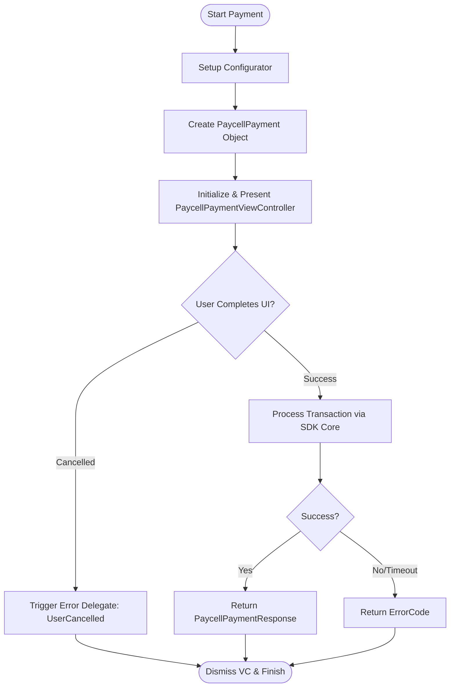

# System Blueprint: Turkcell/PaycellSDK-iOS

> Architecture and code review analysis
>
> Auto-generated on 2026-09-09 by Repo-to-Blueprint Architect

# English Version

## Project Purpose

The PaycellSDK-iOS is a financial services SDK that enables iOS applications to integrate the Paycell payment gateway. It provides a managed UI flow for processing payments via credit cards or Direct Carrier Billing (DCB), supporting installments and 3D Secure verification.

## Technical Stack

* **Language**: Objective-C
* **Framework**: UIKit (as specified in `PaycellSDK.podspec`)
* **Key Dependencies**: CocoaPods (for distribution)
* **Infrastructure**: iOS 8.0+ deployment target

## Use Case Diagram



Evidence: `README.md`, `Frameworks/PaycellSDK.framework/Headers/PaycellPaymentViewController.h`, `Frameworks/PaycellSDK.framework/Headers/PaycellPaymentConfigurator.h`

## System Architecture / Component Diagram



Evidence: `PaycellSDK.podspec`, `README.md`, `Frameworks/PaycellSDK.framework/Headers/PaycellSDK.h`

## Sequence Diagram

```mermaid
sequenceDiagram
    participant App as Merchant App
    participant Config as PaycellPaymentConfigurator
    participant VC as PaycellPaymentViewController
    participant SDK as PaycellSDK Core

    App->+Config: sharedConfigurator.setMerchantCode(...)
    Note right of Config: Sets environment & credentials

    App->+VC: initWithPayment:delegate:
    VC->+SDK: Start Payment Flow
    SDK->>VC: Load Payment3DVC / AddCardConfirmationVC
    Note over VC,SDK: User enters payment details

    SDK->>App: paycellPaymentViewController:didCompletePayment:
    App->-VC: dismissViewControllerAnimated:

```

Evidence: `README.md`, `Frameworks/PaycellSDK.framework/Headers/PaycellPaymentViewController.h`, `Frameworks/PaycellSDK.framework/Main.storyboardc/Payment3DVC.nib`

## Class Diagram



Evidence: `Frameworks/PaycellSDK.framework/Headers/PaycellInstallment.h`, `Frameworks/PaycellSDK.framework/Headers/PaycellPayment.h`, `Frameworks/PaycellSDK.framework/Headers/PaycellPaymentResponse.h`, `Frameworks/PaycellSDK.framework/Headers/PaycellPaymentViewController.h`

## Activity Diagram / Flowchart



Evidence: `README.md`, `Frameworks/PaycellSDK.framework/Headers/PaycellPaymentViewController.h`

## Evidence-Based Risks

1. **Insecure Transport Configuration**: The `README.md` explicitly instructs users to set `NSAllowsArbitraryLoads` to `true` and `NSExceptionAllowsInsecureHTTPLoads` for `services.paycell.com.tr`. This downgrades App Transport Security (ATS) protections for the entire app.
2. **Binary Distribution Lock-in**: Implementation logic is provided only as a compiled Mach-O binary (`Frameworks/PaycellSDK.framework/PaycellSDK`), preventing security auditing of the internal handling of payment data.
3. **Legacy Platform Support**: The `PaycellSDK.podspec` targets iOS 8.0, which lacks modern security features and modern Objective-C/Swift interoperability optimizations.

## Code Review

### Priority Summary

| ID | Priority | Category | Technical Debt | Evidence | Impact | Recommended Action |
| :--- | :--- | :--- | :--- | :--- | :--- | :--- |
| SEC-01 | P1 | Security | ATS Downgrade (Insecure HTTP) | `README.md` (NSAllowsArbitraryLoads) | Exposes app traffic to Man-in-the-Middle (MitM) attacks. | Enforce HTTPS/TLS 1.2+ for all SDK endpoints. |
| TEC-01 | P2 | Technology | Deprecated Deployment Target | `PaycellSDK.podspec` (s.platform = :ios, "8.0") | Prevents use of modern iOS APIs and increases maintenance overhead. | Bump minimum iOS version to a supported release (e.g., iOS 12.0+). |
| ARC-01 | P2 | Architecture | UI-Logic Coupling via NIBs | `Frameworks/PaycellSDK.framework/Main.storyboardc/` | Compiled NIBs are difficult to customize or theme by the host application. | Transition to a programmatic UI or SwiftUI-based dynamic layouts. |
| STA-01 | P3 | Static Analysis | Manual Memory/Old Patterns | `PaycellPayment.h` (nonatomic, strong) | Objective-C usage without evidence of modern nullability annotations in some areas. | Conduct a full Swift migration or add comprehensive `_Nullable` annotations. |

### Static Analysis

* P3 STA-01: Usage of legacy Objective-C property patterns. While functional, modern Swift-interop requires strict nullability auditing which is partially present but inconsistent across headers. (Evidence: `PaycellPayment.h`, `PaycellPaymentResponse.h`)

### Security

* P1 SEC-01: The SDK setup guide requires enabling `NSAllowsArbitraryLoads`. This is a critical security bypass that affects the hosting application's overall security posture. (Evidence: `README.md` under App Transport Security settings).

### Architecture

* P2 ARC-01: The SDK relies on compiled `.storyboardc` and `.nib` files. This architecture tightly couples the SDK's internal UI implementation to specific resource files, making it fragile during framework updates and hard for consumers to skin the UI. (Evidence: `Frameworks/PaycellSDK.framework/Main.storyboardc/`)

### Technology

* P2 TEC-01: The SDK is pinned to iOS 8.0, which is obsolete. This limits the ability to utilize modern networking stacks (like URLSession improvements) or modern crypto libraries. (Evidence: `PaycellSDK.podspec`).
* P3 TEC-02: Use of compiled `.car` (Assets.car) and `.ttf` files inside a framework bundle requires specific resource handling that may cause bloat in the host application. (Evidence: `Frameworks/PaycellSDK.framework/Assets.car`, `Frameworks/PaycellSDK.framework/*.ttf`).

---

## Repository Stats
| Metric | Value |
|---|---|
| Total Files | 70 |
| Total Directories | 5 |
| Generated | 2026-09-09 |
| Source | [Turkcell/PaycellSDK-iOS](https://github.com/Turkcell/PaycellSDK-iOS) |

---

*Repo-to-Blueprint Architect via n8n*
