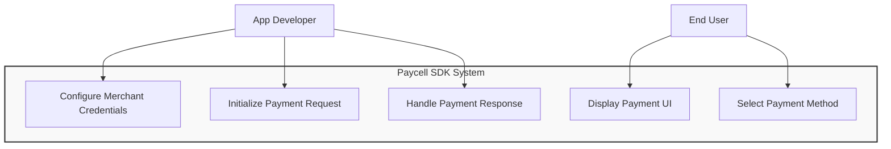
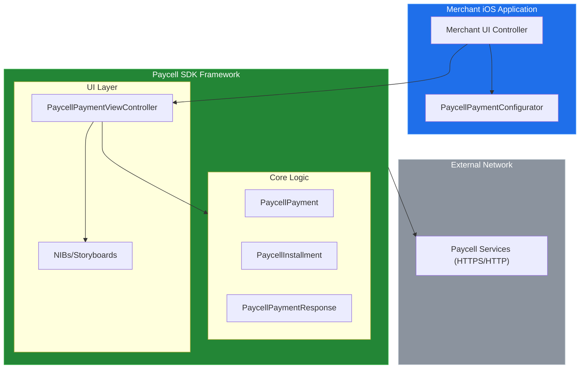
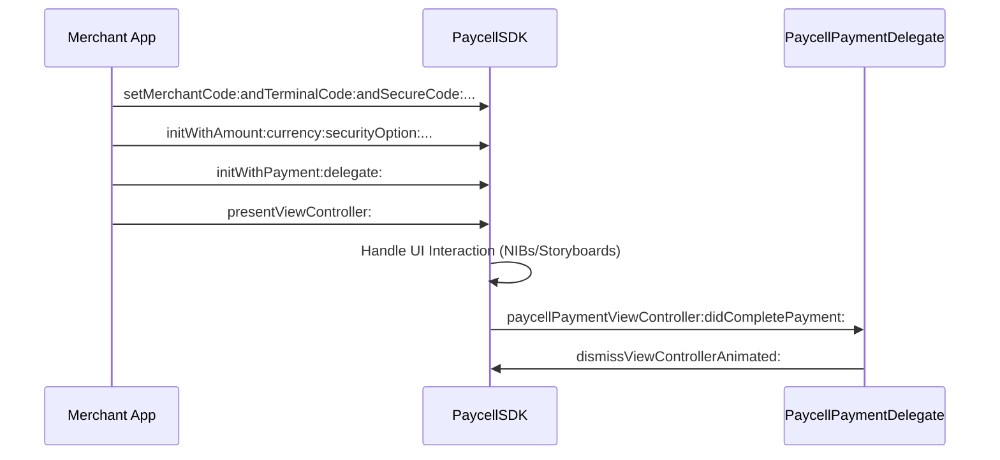
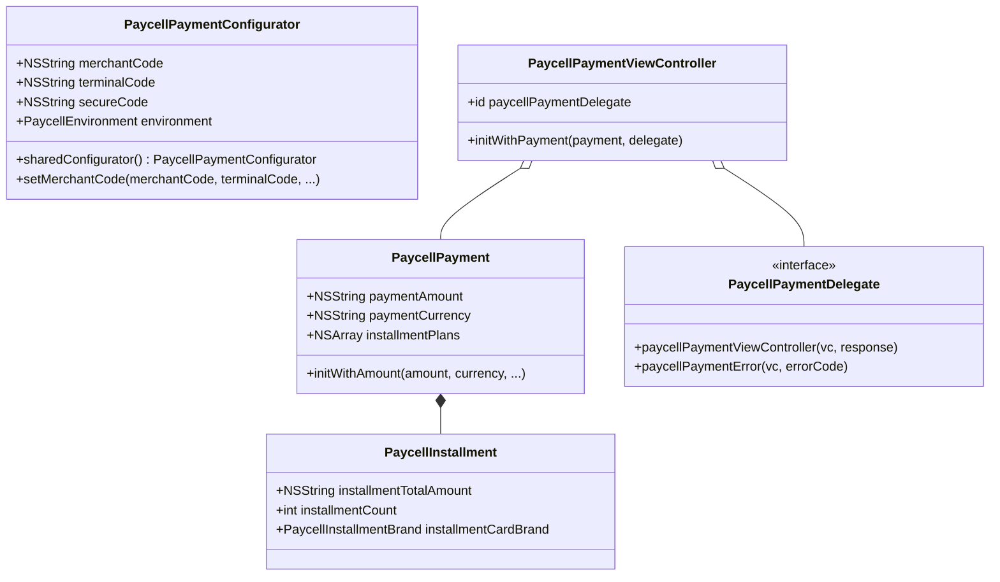
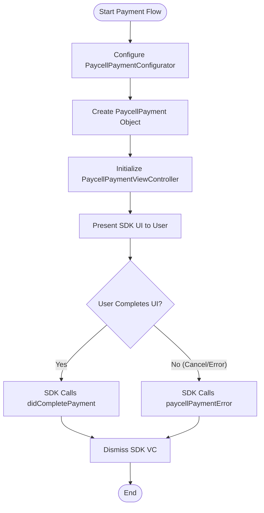

# System Blueprint: Turkcell/PaycellSDK-iOS

> Architecture and code review analysis
>
> Auto-generated on 2026-09-09 by Repo-to-Blueprint Architect

# English Version

## Project Purpose

PaycellSDK-iOS is a mobile payment integration toolkit that allows iOS applications to process payments via the Paycell platform. It provides a managed UI flow for users to authenticate via phone number and complete transactions using saved payment methods, direct carrier billing (DCB), or credit cards with installment support.

## Technical Stack

*   **Language**: Objective-C
*   **Framework**: UIKit (iOS SDK)
*   **Key Dependencies**: Foundation, UIKit (referenced in `PaycellSDK.podspec` and `PaycellSDK.h`)
*   **Infrastructure**: CocoaPods (supported via `PaycellSDK.podspec`)

## Use Case Diagram

Evidence: `PaycellPaymentConfigurator.h`, `PaycellPaymentViewController.h`, `README.md`

## System Architecture / Component Diagram

Evidence: `PaycellPaymentConfigurator.h`, `PaycellPayment.h`, `PaycellPaymentViewController.h`, `README.md`

## Sequence Diagram

Evidence: `PaycellPaymentViewController.h`, `README.md`

## Class Diagram

Evidence: `PaycellPaymentConfigurator.h`, `PaycellPayment.h`, `PaycellInstallment.h`, `PaycellPaymentViewController.h`

## Activity Diagram / Flowchart

Evidence: `README.md`, `PaycellPaymentViewController.h`

## Evidence-Based Risks

1.  **Insecure Network Configuration**: The `README.md` instructs developers to set `NSAllowsArbitraryLoads` to `true` and specifically allows insecure HTTP loads for `services.paycell.com.tr` and `omccstb.turkcell.com.tr`. This bypasses Apple's App Transport Security (ATS) and exposes payment data to potential Man-in-the-Middle (MITM) attacks.
2.  **Legacy Platform Support**: `PaycellSDK.podspec` targets iOS 8.0. This extremely low deployment target implies the code may rely on deprecated APIs and lacks modern security features or architectural optimizations found in newer iOS versions.
3.  **Tight UI Coupling**: The SDK architecture (as seen in `PaycellPaymentViewController.h` and the presence of compiled `.nib`/`.storyboardc` files) forces the use of a specific pre-built UI. This limits merchant flexibility in customizing the payment experience and creates a heavy dependency on `UIKit`.

## Code Review

### Priority Summary

| ID | Priority | Category | Technical Debt | Evidence | Impact | Recommended Action |
| :--- | :--- | :--- | :--- | :--- | :--- | :--- |
| SEC-01 | P0 | Security | Weak ATS Configuration (Insecure HTTP) | `README.md`: `NSAllowsArbitraryLoads` and `NSExceptionAllowsInsecureHTTPLoads` | Risk of data interception and MITM attacks on payment traffic. | Require HTTPS for all production endpoints and remove insecure ATS exceptions. |
| ARC-01 | P1 | Architecture | Rigid UI Inheritance (`UINavigationController`) | `PaycellPaymentViewController.h`: `PaycellPaymentViewController : UINavigationController` | Inheriting from a container controller restricts merchant layout choices and navigation flow. | Use composition or provide a UI-less API alongside the view controller. |
| TEC-01 | P2 | Technology | Outdated Platform Target (iOS 8.0) | `PaycellSDK.podspec`: `s.platform = :ios, "8.0"` | Prevents use of modern Swift interoperability and modern security frameworks. | Update minimum deployment target to a maintained iOS version (e.g., iOS 12+). |
| STA-01 | P3 | Static Analysis | Primitive Type Usage for Amounts | `PaycellInstallment.h`: `NSString *installmentTotalAmount` | Using strings for currency calculation can lead to precision errors or parsing overhead. | Use `NSDecimalNumber` or minor-unit integers for financial calculations. |

### Static Analysis

*   P3 STA-01: Financial amounts are handled as `NSString` types in `PaycellInstallment.h` and `PaycellPayment.h`. This is observed in the initializer patterns: `initWithTotalAmount:(nonnull NSString*)`. While strings avoid floating-point issues, they require rigorous manual parsing compared to `NSDecimalNumber`.

### Security

*   P0 SEC-01: The `README.md` explicitly recommends enabling `NSAllowsArbitraryLoads` and using `NSExceptionAllowsInsecureHTTPLoads` for `services.paycell.com.tr`. This allows clear-text communication for sensitive payment operations.

### Architecture

*   P1 ARC-01: `PaycellPaymentViewController` inherits directly from `UINavigationController` (`PaycellPaymentViewController.h`). This is a "Leaky Abstraction" debt where the SDK dictates the entire navigation stack of the host app during the payment phase.
*   P2 ARC-02: Heavy reliance on compiled NIBs/Storyboards (`Frameworks/PaycellSDK.framework/Main.storyboardc/`) prevents UI localization or styling by the merchant without SDK updates.

### Technology

*   P2 TEC-01: The project targets iOS 8.0 (`PaycellSDK.podspec`), which is obsolete. This limits the ability to use modern Objective-C features (like nullability annotations, though some are present) and modern iOS security protocols.
*   P3 TEC-02: Hardcoded currency logic (`README.md` suggests "99" for TL) and hardcoded installment brands in `PaycellInstallment.h` (e.g., `PaycellInstallmentBrand_AXESS`) make the SDK difficult to extend for new regions or card brands without a binary update.

---

## Repository Stats
| Metric | Value |
|---|---|
| Total Files | 70 |
| Total Directories | 5 |
| Generated | 2026-09-09 |
| Source | [Turkcell/PaycellSDK-iOS](https://github.com/Turkcell/PaycellSDK-iOS) |

---

*Repo-to-Blueprint Architect via n8n*
