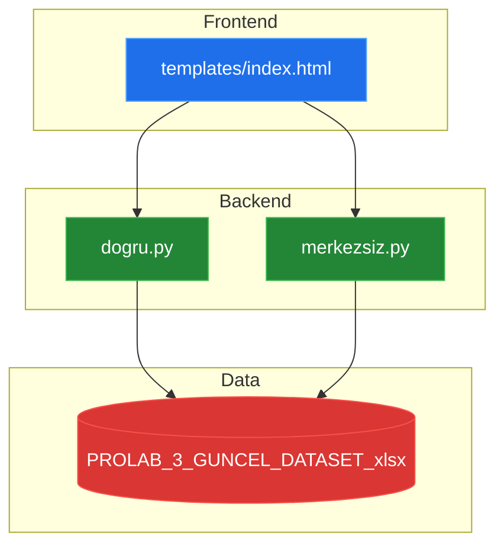
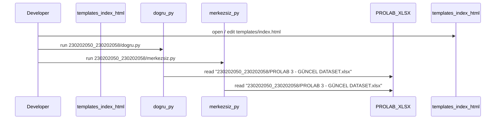

# System Blueprint: YusuffBulbul/Python-Makale-Yazar-liskisi-Graf

> Architecture and code review analysis
>
> Auto-generated on 2026-09-07 by Repo-to-Blueprint Architect

# English Version

## Project Purpose
This repository contains Python scripts (230202050_230202058/dogru.py and 230202050_230202058/merkezsiz.py), an HTML template (230202050_230202058/templates/index.html) and an Excel dataset (230202050_230202058/PROLAB 3 - GÜNCEL DATASET.xlsx). The files indicate work against that dataset and a static HTML template; no explicit web application entry point or dependency manifest is present in the repository evidence.

## Technical Stack
- **Language**: Python (.py) and HTML (.html)
- **Key Dependencies**: None specified (no requirements.txt, pyproject.toml, or package.json present in the repository)

## Architecture Blueprint

## Request Flow

## Evidence-Based Risks
1. The repository includes a binary Excel dataset at 230202050_230202058/PROLAB 3 - GÜNCEL DATASET.xlsx, which may contain sensitive data committed to source control (file present in repo root folder 230202050_230202058).
2. There is no dependency manifest (no requirements.txt or pyproject.toml) while Python scripts exist at 230202050_230202058/dogru.py and 230202050_230202058/merkezsiz.py, impeding reproducible setup.
3. No clear application entry point or framework file is present (no main.py, app.py, or framework-specific starter files), only standalone scripts and a template (files: 230202050_230202058/dogru.py, 230202050_230202058/merkezsiz.py, 230202050_230202058/templates/index.html), reducing discoverability of how to run the project.

## Code Review

### Priority Summary
| ID | Priority | Category | Technical Debt | Evidence | Impact | Recommended Action |
|---|---:|---|---|---|---|---|
| [SEC-01] | P1 | Security | Sensitive data committed as an Excel file | 230202050_230202050_230202058/PROLAB 3 - GÜNCEL DATASET.xlsx — file present in repository | Potential data exposure and increased repo size | Remove dataset from VCS, add to .gitignore, store dataset in secured storage; replace with a sample or script to fetch data. |
| [TEC-01] | P1 | Technology | Missing dependency manifest for Python scripts | 230202050_230202058/dogru.py and 230202050_230202058/merkezsiz.py exist while no requirements.txt or pyproject.toml is present in repo | Non-reproducible environment and install ambiguity | Create requirements.txt or pyproject.toml listing runtime dependencies; include setup/run instructions in README. |
| [ARC-01] | P2 | Architecture | No clear application entry point or framework | Presence of templates/index.html and only standalone scripts at 230202050_230202058/; absence of main.py/app.py or framework config files | Reduced discoverability and unclear run/deploy model | Add a clear entry-point (e.g., app.py or README run instructions) and document expected runtime (CLI or web). |
| [STA-01] | P2 | Static Analysis | No tests detected in repository | File tree contains no tests/ directory or test_*.py files | Lack of automated verification for code changes | Add unit tests (e.g., tests/), CI-friendly test runner, and example inputs/expected outputs. |
| [TEC-02] | P3 | Technology | No linting/formatting/tooling configuration present | No .flake8, pyproject.toml (for tool config), or .pre-commit-config.yaml files present | Inconsistent code style and lower maintainability | Add a basic linter/formatter config (pyproject.toml or .flake8) and optional pre-commit config. |
| [STA-02] | P3 | Static Analysis | No README run instructions for scripts | README_ARCH.md exists but repository lacks explicit run instructions for dogru.py and merkezsiz.py | New contributors cannot quickly run scripts | Add concise run steps in README or create an executable entry-point with a help/usage flag. |

### Static Analysis
- [P2] STA-01 Missing tests: No tests directory or test files found in repository (file tree: only .py, .html, .xlsx, README_ARCH.md). Add unit tests and example inputs.
- [P3] STA-02 Missing run documentation: No explicit run instructions for 230202050_230202058/dogru.py and 230202050_230202058/merkezsiz.py; README_ARCH.md exists but appears not to contain runnable examples (file present README_ARCH.md). Add usage examples or CLI help.

### Security
- [P1] SEC-01 Committed dataset: 230202050_230202058/PROLAB 3 - GÜNCEL DATASET.xlsx is stored in the repo. Consider removing sensitive or large datasets from VCS and using external secure storage or adding a scrubbed sample.

### Architecture
- [P2] ARC-01 Missing entry point / unclear runtime model: Only standalone scripts and a template exist (230202050_230202058/dogru.py, 230202050_230202058/merkezsiz.py, 230202050_230202058/templates/index.html), with no framework or app bootstrap files. Add a documented entry point or standardize on a framework layout.

### Technology
- [P1] TEC-01 Missing dependency manifest: No requirements.txt, pyproject.toml, or setup files present while Python scripts exist (230202050_230202058/*.py). Add a dependency list for reproducibility.
- [P3] TEC-02 Missing tooling configs: No linter/formatter or pre-commit config files detected in the repository root; add pyproject.toml/.flake8/.pre-commit-config.yaml as appropriate.

(End of English report)

---

## Repository Stats
| Metric | Value |
|---|---|
| Total Files | 5 |
| Total Directories | 2 |
| Generated | 2026-09-07 |
| Source | [YusuffBulbul/Python-Makale-Yazar-liskisi-Graf](https://github.com/YusuffBulbul/Python-Makale-Yazar-liskisi-Graf) |

---

*Repo-to-Blueprint Architect via n8n*
